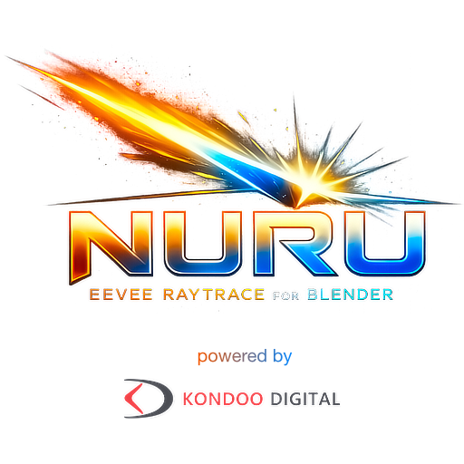

<!-- SPDX-FileCopyrightText: 2026 Kondoo Digital GmbH -->
<!-- SPDX-License-Identifier: GPL-2.0-or-later -->
<!-- GitHub renders README.md as the repository landing README. This file mirrors README.html in GitHub-safe markup. -->

<div align="center">
  

  <p><strong>Metal/RTX Hardware Ray Tracing for Blender Eevee.</strong></p>
  <p>A Blender branch by Kondoo Digital GmbH for per-feature Hardware RT in Eevee.</p>

  <p>
    <a href="#what-nuru-is">What Nuru Is</a> |
    <a href="#what-nuru-does">What It Does</a> |
    <a href="#how-to-use-nuru-in-blender">How To Use</a> |
    <a href="#current-diamond-1-scope">Diamond 1 Scope</a> |
    <a href="#developer-quick-start">Developer Quick Start</a>
  </p>
</div>

## What Nuru Is

Nuru is an experimental Blender/Eevee Hardware RT branch. It adds a user-facing
`Nuru Raytracing` method to Eevee and lets artists decide which parts of a scene
are owned by hardware ray tracing and which parts remain on classic Eevee.

The current **DIAMOND** implementation is Metal-first. It targets Apple GPUs
with hardware ray tracing support and keeps Blender's normal multi-platform
source tree intact. **EMERALD** will folloe OptiX and CUDA Nuru backend support and are Work in Progress.

<table>
  <tr>
    <th align="left">Area</th>
    <th align="left">Diamond 1 Status</th>
  </tr>
  <tr>
    <td>Viewport backend</td>
    <td>Metal only</td>
  </tr>
  <tr>
    <td>Practical device target</td>
    <td>Apple M3+ on macOS 14+</td>
  </tr>
  <tr>
    <td>Backend roadmap</td>
    <td>Metal is active; OptiX and CUDA Nuru support are Work in Progress</td>
  </tr>
  <tr>
    <td>Fallback behavior</td>
    <td>Classic Eevee remains responsible when Nuru or an individual HWRT feature is off</td>
  </tr>
</table>

## What Nuru Does

- **Global Illumination** uses regular Hardware RT diffuse transport.
- **Raytrace Shadows** uses explicit Hardware RT shadow visibility passes.
- **Raytrace Environment** handles environment visibility and world-shadow transport.
- **Raytrace Reflections** can move reflections from classic Eevee to Full RT.
- **Raytrace Refractions** can be Off or Full RT.
- **Indirect GI** enables Primary and Secondary GI.
- Scene-final reflection/refraction passes can use sparse material replay, with proxy fallback when replay is unavailable.
- Rough GGX reflection/refraction material evaluation can request roughness-aware texture filtering for supported texture inputs.

Nuru is not a path tracer and does not claim Cycles parity. It is an Eevee
renderer path with hardware ray tracing where the current implementation has
explicit ownership.

That hybrid renderer design has practical advantages:

- **Interactive feedback stays central.** Nuru keeps Eevee's real-time renderer model and adds Hardware RT where it is useful instead of replacing the whole frame with path tracing.
- **Feature ownership is predictable.** GI, shadows, environment, reflections, and refractions can be enabled independently, so classic Eevee remains available where it is still the better or safer path.
- **Artists can trade quality and cost per feature.** A scene can use Hardware RT reflections without forcing every lighting effect into the same expensive sampling model.
- **Eevee compatibility remains valuable.** Existing Eevee materials, probes, viewport workflows, and production expectations continue to matter in the hybrid renderer.
- **Hardware RT is focused on visible wins.** Nuru uses ray tracing for scene intersections, visibility, scene-final specular paths, material replay, and Primary and Secondary GI while keeping the renderer responsive.

## How To Use Nuru In Blender

1. Open **Render Properties**.
2. Set **Render Engine** to **Eevee**.
3. Open the **Raytracing** panel and enable ray tracing.
4. Set **Method** to **Nuru Raytracing**.
5. If the hardware gate is supported, the Nuru status panel shows the logo and enables **Quick Settings**.
6. Enable only the features you want Hardware RT to own.
7. Tune **GI Resolution**, **Indirect GI**, **Indirect GI Resolution**, reflection **Bounces**, refraction **Bounces**, and **Indirect Clamp**.

> When **Nuru Raytracing** is selected, Blender's classic **Fast GI Approximation**
> panel is intentionally inactive for the hardware method. Nuru uses its own
> Hardware RT GI controls instead.

Material Preview does not partially activate Nuru. Use **Rendered** viewport or
final render paths when validating Nuru behavior.

## macOS Release Download Note

The current v0.9 macOS release build is for now unsigned and not notarized with
Apple Developer ID. After downloading the ZIP from GitHub, macOS Gatekeeper may
show a message that `Blender.app` is "damaged" and cannot be opened.

To use the downloaded release, remove the quarantine attribute before opening it:

```sh
xattr -dr com.apple.quarantine /path/to/Blender.app
```

## Current Diamond 1 Scope

<table>
  <tr>
    <th align="left">Implemented</th>
    <th align="left">Work In Progress / Current Limits</th>
  </tr>
  <tr>
    <td valign="top">
      <ul>
        <li>Metal Hardware RT scene tracing and acceleration structure support.</li>
        <li>High performance Apple M3+ GI / RT optimisation and Metal offload.</li>
        <li>Hardware RT diffuse GI as the active Nuru GI path.</li>
        <li>Hardware RT shadow and environment visibility.</li>
        <li>Full RT reflection and refraction ownership.</li>
        <li>Scene-final specular resolve, sparse material replay, and proxy fallback.</li>
        <li>Primary and Secondary GI.</li>
        <li>Rough material texture filtering for implemented rough reflection/refraction material evaluation.</li>
      </ul>
    </td>
    <td valign="top">
      <ul>
        <li>OptiX and CUDA Nuru backend support are Work in Progress.</li>
        <li>Extended Shading and EEVEE/Cycles shader parity are Work in Progress.</li>
        <li>EEVEE shaders are usually working; however, as Nuru is raytracing, some shaders and textures may need adjustments.</li>
        <li>Apple M1/M2 and non-RTX-class cards cannot be supported due to lack of RT cores.</li>
        <li>Pathtracer-equivalent sharp mirror correctness for Primary and Secondary GI.</li>
      </ul>
    </td>
  </tr>
</table>

## Developer Quick Start

This repository follows Blender's normal build flow, with repo-local build roots
under `builds/`.

```sh
make update
cmake --build builds/macos-dev --target blender -j 12
cmake --install builds/macos-dev
```

For focused Nuru/Eevee or Metal HWRT changes:

```sh
cmake --build builds/macos-dev --target bf_gpu bf_draw blender -j 12
```

If RNA, DNA, or blend-file versioning changed:

```sh
cmake --build builds/macos-dev --target makesdna makesrna bf_dna bf_rna bf_blenloader bf_gpu bf_draw blender -j 12
```

## Documentation

- [`docs/eevee_hwrt_first_release.md`](docs/eevee_hwrt_first_release.md) - first-release runtime contract.
- [`docs/eevee_hwrt_ship_criteria.md`](docs/eevee_hwrt_ship_criteria.md) - validation and release criteria.
- [`docs/eevee_hwrt_system_interactions.md`](docs/eevee_hwrt_system_interactions.md) - ownership rules between Nuru and classic Eevee.
- [`docs/eevee_hwrt_artifact_triage.md`](docs/eevee_hwrt_artifact_triage.md) - evidence-first debugging guide.

## Upstream Blender Links

- [Blender Website](https://www.blender.org)
- [Blender Reference Manual](https://docs.blender.org/manual/en/latest/index.html)
- [Blender Developer Documentation](https://developer.blender.org/docs/)
- [Blender Code Review & Bug Tracker](https://projects.blender.org)

## License

Nuru documentation and Kondoo Digital additions are attributed to Kondoo Digital
GmbH under the Blender GPL license.

Blender as a whole is licensed under the GNU General Public License. See
[blender.org/about/license](https://www.blender.org/about/license) for details.
