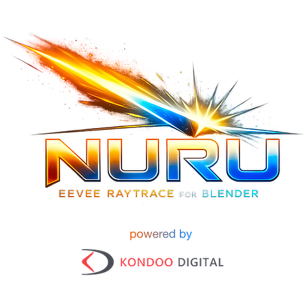

<!-- SPDX-FileCopyrightText: 2026 Kondoo Digital GmbH -->
<!-- SPDX-License-Identifier: GPL-2.0-or-later -->

<div align="center">
  

  <p>
    <a href="https://vimeo.com/1195782891" title="Blender Nuru Demo"></a>
    <br>
    <a href="https://vimeo.com/1195782891"><strong>&#9654; Watch the Blender Nuru demo on Vimeo</strong></a>
  </p>

  <p><strong>Hardware ray tracing for Blender Eevee, built for responsive real-time work.</strong></p>
  <p><em>Nuru</em> means <strong>light</strong> in Swahili.</p>
  <p>A Blender branch by <strong>Kondoo Digital GmbH</strong>.</p>

  <p>
    <a href="https://kondoodigital.github.io/blender-nuru/"><strong>Website</strong></a> |
    <a href="#what-nuru-is">What Nuru Is</a> |
    <a href="#how-to-use-nuru">How To Use</a> |
    <a href="#main-controls">Main Controls</a> |
    <a href="#multi-os-branches">Multi-OS Branches</a> |
    <a href="#current-limits">Current Limits</a> |
    <a href="#documentation">Docs</a>
  </p>

  <table>
    <tr>
      <th align="center" width="33%">Windows</th>
      <th align="center" width="33%">macOS</th>
      <th align="center" width="33%">Linux</th>
    </tr>
    <tr>
      <td align="center">NVIDIA RTX &middot; Vulkan</td>
      <td align="center">Apple Silicon M3+ &middot; Metal</td>
      <td align="center">Vulkan</td>
    </tr>
    <tr>
      <td align="center"><a href="https://github.com/kondoodigital/blender-nuru/releases/download/v5.1.1-0.9.8/Blender-Nuru-windows-5.1.1-0.9.8.exe"><strong>Installer 5.1.1-0.9.8</strong></a><br/><a href="https://github.com/kondoodigital/blender-nuru/releases/download/v5.1.1-0.9.8/Blender-Nuru-windows-5.1.1-0.9.8.zip">Portable Zip</a></td>
      <td align="center"><a href="https://github.com/kondoodigital/blender-nuru/releases/download/v5.1.1-0.9.8/Blender-Nuru-macos-5.1.1-0.9.8.zip"><strong>Download 5.1.1-0.9.8</strong></a></td>
      <td align="center"><a href="https://github.com/kondoodigital/blender-nuru/releases/download/v5.1.1-0.9.8/Blender-Nuru-linux-5.1.1-0.9.8.deb"><strong>Deb Package 5.1.1-0.9.8</strong></a><br/><a href="https://github.com/kondoodigital/blender-nuru/releases/download/v5.1.1-0.9.8/Blender-Nuru-linux-5.1.1-0.9.8.tar.gz">Portable Tar</a></td>
    </tr>
  </table>
</div>

## What Nuru Is

**Nuru** adds a **Nuru Raytracing** method to Blender Eevee. It lets artists choose which parts of the render use hardware ray tracing: global illumination, shadows, reflections, and refractions.

Nuru is a hybrid real-time renderer. It is designed for interactive viewport feedback in Eevee, not as a replacement for Cycles.

| Area | Status |
| --- | --- |
| Packaged backends | Metal on macOS (`macos-metal`), Vulkan on Windows (`windows-vulkan`), and Vulkan on Linux (`linux-vulkan`) |
| Shared source branch | `nuru-core` |
| macOS implementation branch | `macos-metal` |
| Windows implementation branch | `windows-vulkan` |
| Linux implementation branch | `linux-vulkan` |
| Recommended macOS hardware | Apple M3 or newer |
| Recommended macOS version | macOS 14 or newer |
| Unsupported Apple GPUs | M1 and M2 do not provide the required hardware RT support |
| Recommended Windows hardware | NVIDIA GeForce RTX (RTX 20 series or newer) with a current driver |
| Recommended Windows version | Windows 10 or 11, 64-bit |
| Recommended Linux hardware | NVIDIA GeForce RTX (RTX 20 series or newer) with the 595-series or newer proprietary driver |
| Recommended Linux version | 64-bit Linux; Ubuntu 22.04+ / Debian 12+ for the `.deb`, any current distribution for the portable archive |

## Why Use Nuru

Nuru is strongest when you need fast, stable images while working or rendering animation.

- **High-resolution output:** At 4K and above, Nuru can keep expensive RT work at a lower internal **Resolution** while still producing a high-resolution final image. The Resolution setting applies to every traced effect, including reflections and refractions.
- **True materials in reflections:** Mirrors and refractive surfaces show the real material of what they reflect — image textures, UV maps, and mixed shader setups stay intact in the reflection.
- **Volumetrics:** Object and world volumes render in viewport and final frames, including lit fog and sun shafts through windows.
- **Animation stability:** Integrated denoising and temporal accumulation help reduce frame-to-frame noise shimmer that can appear in low-sample path-traced animation.
- **Fast repeated frames:** After the first warm-up, animation frames can progress quickly because Nuru traces selected effects instead of path tracing every light path from scratch.
- **Interactive look development:** The **Rendered** viewport and final render use the same Nuru lighting path, so lighting and material decisions carry over reliably.
- **Selective cost:** You can enable only the RT features you need: GI, shadows, reflections, or refractions.

## How To Use Nuru

1. Open **Render Properties**.
2. Set the render engine to **Eevee**.
3. Enable **Raytracing**.
4. Set **Method** to **Nuru Raytracing**.
5. Use **Quick Settings** to enable the RT features you need.

Nuru runs in **Rendered** viewport and final render. **Material Preview** uses Blender's standard preview path.

## Main Controls

| Control | What it does |
| --- | --- |
| **Resolution** | Sets the trace resolution: 100%, 75%, 50%, or 25%. Lower values are faster. |
| **Global Illumination** | Enables diffuse hardware-traced indirect light. |
| **GI Spatial** | Increases spatial reuse for smoother diffuse GI. |
| **Raytrace Reflections** | Enables Full RT reflections. |
| **Raytrace Refractions** | Enables Full RT refractions and transmission. |
| **Bounces** | Sets how many reflection or refraction events can continue. |
| **Raytrace Shadows** | Uses hardware ray tracing for shadow visibility. |
| **Samples** | Controls the quality of soft RT shadows. |
| **Transparent Shadows** | Controls how much transparent material affects shadow strength. |
| **Color Transmission** | Controls how strongly transparent materials tint shadows. |
| **Indirect Light** | Adjusts global indirect light strength. |
| **Indirect Clamp** | Reduces extreme indirect highlights and fireflies. |
| **Denoise** | Controls the viewport denoising options shown in Quick Settings. |

For the full UI reference, see [`docs/nuru_ui_reference.html`](docs/nuru_ui_reference.html).

## Multi-OS Branches

Nuru now uses a shared-core plus thin platform-branch model:

| Branch | Purpose |
| --- | --- |
| `nuru-core` | Shared Nuru UI, RNA/DNA, material behavior, Eevee orchestration, docs, and backend-neutral hardware ray tracing API. |
| `macos-metal` | Apple Metal hardware ray tracing implementation, macOS app bundle, and macOS build/test helper changes. |
| `windows-vulkan` | Windows Vulkan implementation branch, based on `nuru-core`. |
| `linux-vulkan` | Linux Vulkan implementation branch, based on `nuru-core`. |

Packaged builds are available for macOS (Metal), Windows (Vulkan, NVIDIA RTX), and Linux (Vulkan, NVIDIA RTX).

## Current Limits

- Nuru is not active in **Material Preview**.
- Some complex material graphs may need adjustment for stable RT results.
- Rough reflections soften texture detail by design; keep the trace **Resolution** at 100% for the sharpest mirrors or lower it for speed.
- Nuru is not a path tracer and is not intended to match Cycles feature-for-feature.

## macOS Download Note

If your macOS build is unsigned and not notarized, Gatekeeper may report that `Blender-Nuru.app` is damaged. Remove quarantine from the app bundle:

```sh
xattr -dr com.apple.quarantine /path/to/Blender-Nuru.app
```

## Windows Download Note

The Windows build is unsigned, so the first start may show **"Windows protected your PC"** (SmartScreen). Click **More info**, then **Run anyway**. Unzip the package anywhere and start `Blender-Nuru.exe`; see [Nuru On Windows](https://kondoodigital.github.io/blender-nuru/docs/nuru_windows.html) for requirements and details.

## Linux Download Note

Install the `.deb` with `sudo apt install ./Blender-Nuru-linux-<version>.deb` (Ubuntu 22.04+ / Debian 12+), or unpack the portable `.tar.gz` anywhere and start `./blender-nuru`. Nuru hardware ray tracing needs the NVIDIA proprietary driver, 595 series or newer; see [Nuru On Linux](https://kondoodigital.github.io/blender-nuru/docs/nuru_linux.html) for requirements and details.

## Documentation

Browse the documentation website: [kondoodigital.github.io/blender-nuru](https://kondoodigital.github.io/blender-nuru/) — every page below renders there directly.

- [Nuru Overview](https://kondoodigital.github.io/blender-nuru/docs/nuru_overview.html) explains Nuru at a high level.
- [UI Reference](https://kondoodigital.github.io/blender-nuru/docs/nuru_ui_reference.html) documents the visible UI controls.
- [Shadows And Lights](https://kondoodigital.github.io/blender-nuru/docs/nuru_shadows_and_lights.html) explains RT shadows and transparent shadow controls.
- [Materials](https://kondoodigital.github.io/blender-nuru/docs/nuru_materials.html) explains material expectations and current limits.
- [Dos And Don'ts](https://kondoodigital.github.io/blender-nuru/docs/nuru_dos_and_donts.html) is the practical dos-and-don'ts guide for materials and settings.
- [Nuru On macOS](https://kondoodigital.github.io/blender-nuru/docs/nuru_macos.html) covers macOS requirements, installation, and platform notes.
- [Nuru On Windows](https://kondoodigital.github.io/blender-nuru/docs/nuru_windows.html) covers Windows requirements, installation, and platform notes.
- [Nuru On Linux](https://kondoodigital.github.io/blender-nuru/docs/nuru_linux.html) covers Linux requirements, installation, and platform notes.

The same pages ship inside every download under `docs/`.
- [`docs/nuru_linux.html`](docs/nuru_linux.html) covers Linux requirements, installation, and platform notes.

## Upstream Blender Links

- [Blender Website](https://www.blender.org)
- [Blender Manual](https://docs.blender.org/manual/en/latest/index.html)
- [Blender Developer Documentation](https://developer.blender.org/docs/)

## License

Nuru documentation and Kondoo Digital additions are provided under Blender's GPL license. Blender as a whole is licensed under the GNU General Public License. See [blender.org/about/license](https://www.blender.org/about/license) for details.
